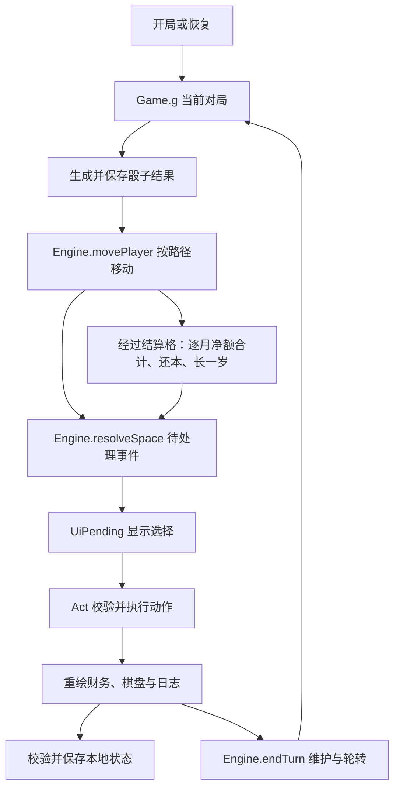

# 游戏结构与维护

核对日期：2026-10-03。这是无后端、无构建依赖的静态浏览器应用，脚本依次挂载到 `window`，没有模块打包器或服务端状态。

## 文件与职责

| 文件 | 职责与主要接口 |
|---|---|
| [index.html](../index.html) | 开局页、棋盘、财务区、日志、弹层容器及按内容版本加载的资源 |
| [data-careers.js](../js/data-careers.js) | 12 个职业；时间、人生、贷款、估值、经营和收益配置 |
| [data-board.js](../js/data-board.js) | 两条 24 格棋盘、10 个组合、6 个梦想、7 家自由圈企业 |
| [data-cards-101.js](../js/data-cards-101.js)、[data-cards-202.js](../js/data-cards-202.js) | 投资、行情和意外支出卡 |
| [engine.js](../js/engine.js) | `Engine`：开局与随机、财务推导、结算、估值、迁移、轮转和胜负 |
| [engine-actions.js](../js/engine-actions.js) | `Act`：买卖、借还、机会、家庭事件、机构合伙和玩家间交易 |
| [save-state.js](../js/save-state.js) | `SaveState`：本地存档编码、结构校验、临时迁移和随机恢复 |
| [ui-core.js](../js/ui-core.js) | `UI`：公共组件、财务与资产明细、开局设置、主题、提示和弹层 |
| [ui-game.js](../js/ui-game.js) | `Game` / `UiGame`：当前对局、棋盘动作、贷款页、交易、保存与恢复 |
| [ui-pending.js](../js/ui-pending.js) | `UiPending`：按待处理事件显示选择并调用动作，处理借款后返回 |
| [ui-summary.js](../js/ui-summary.js) | `UiSummary`：等级、财富轨迹、复盘、Markdown / JSON 报告 |
| [ui-cash-report.js](../js/ui-cash-report.js) | `UiCashReport`：读取当前账本，按模板显示个人损益与资产负债表、切换玩家及实时刷新 |
| [main.js](../js/main.js) | 启动完整性检查、事件绑定与尝试续局 |
| [css/base.css](../css/base.css)、[css/game.css](../css/game.css) | 公共样式、响应式棋盘、明暗主题与游戏界面 |

加载顺序为配置 → 引擎 → 动作 → 存档 → 界面 → 启动。`index.html` 中的资源 URL 包含内容摘要；脚本不完整或缺少当前结算接口时禁止启动，提供重新载入入口并保留原存档。

## 状态与操作路径



`g` 保存规则、模式、玩家、当前席位、轮次、随机状态、牌堆、行情、挂牌池、日志和 `pending`。`p` 保存个人年龄、现金、收入状态、资产、个人负债、家庭、经营合同、成就和财富轨迹。`Game.rolled` 与待执行骰子属于行动视图状态，也随完整存档保存。

年龄是玩家字段；`round` 与 `turnNo` 是行动顺序。股票使用共享报价，房产实体使用 `propertyId`，具体持仓使用 `holdingId`。数组索引和资产名称不能替代交易身份。

## 财务与数据约定

- `finance` 返回月收入、生活及其他支出、月供和净额；自由圈用 `ftFinance`。`settleCashflow` 统一当前月净额。
- `settlementPlan` 预演未来 12 个月实际本息，返回年度净额和摊还结果；`movePlayer` 用同一结果入账。界面显示 `landed.settled`，不自行重新发薪。
- 金融收益和贷款利率按月建模，成本、现金、首付、售价是一次性金额。`annual` 只做固定月金额换算，不能替代尾期贷款计划。
- 投资机会的 `pending.flow` 保存已考察方向、单笔投资决定与行情确认状态；行情子事项以 `returnOpportunity` 保留原机会，所有事项完成后才解除待处理事件。见 [机会与行情](机会与行情事项.md)。
- 拒绝交易不应留下部分扣款。金额、持仓身份、报价、精力、参与者及机会状态须在落账前核对；重复点击不能再次出售或兑付。
- 房产项目融资和家庭分期负债是两套模型，同一融资不可登记两次。参考净资产允许负权益，抵押权益最低为零。
- 旧档迁移只改变有证据支持的未来计算；锁定事件、现金及历史结算不重放。不能识别的旧账保留提示。

## 开发与验证

```bash
python3 -m http.server 8080
node tools/version-assets.js --check
```

改动资源后运行 `node tools/version-assets.js`。改变账本应运行贷款、结算、家庭及长局测试；改变买卖应运行资产、房产、兑付和转让测试；改变保存应运行存档与随机测试，并执行受影响的浏览器交互。完整命令见 [测试目录](../test/README.md)。

价格重算会写文件，使用范围见 [标定说明](出圈门槛与投资回报标定.md)。本项目没有 npm 安装步骤，没有自动部署脚本配置在仓库内；线上静态站点应另核对实际内容版本。许可与贡献范围见 [许可说明](许可说明.md)。

游戏界面无备份、导入、恢复或历史核对入口。内部维护的旧档核对在 `SaveState.planRepair` 的临时副本中计算差异，`UiGame.applyRepair` 校验预览状态、保存原档后调用原子恢复流程；依据和补充历史保存在 `g.recovery`。见 [历史核对](旧档核对与修复.md)。
